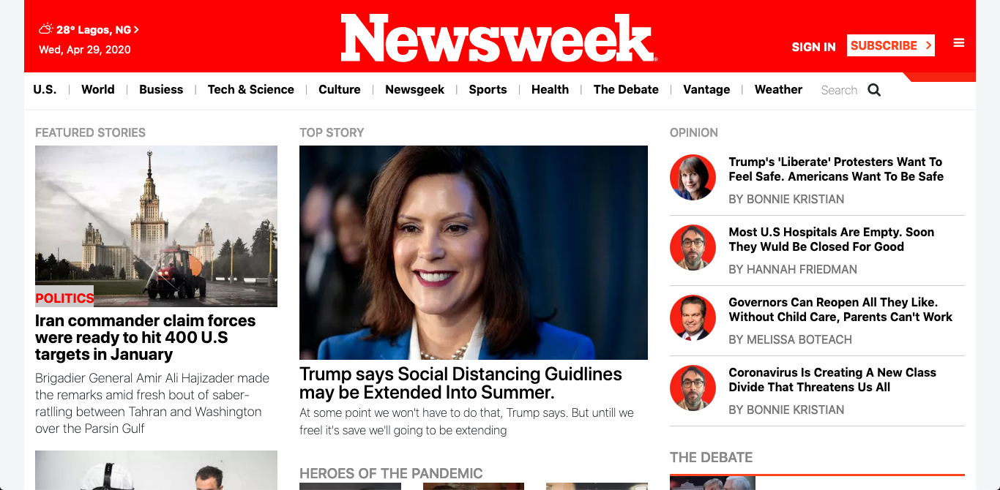

# Newsweek Homepage

 A realistic clone of the Newsweek Homepage

This project specifies to build an exact replica of Newsweek.com using the Bootstrap framework. It is not required to use Javascript in this project or to add interactivity.

## Built With

- HTML5,
- CSS3,
- BOOTSTRAP

## Live Demo

[Live Demo Link](https://wizardly-leakey-4367fc.netlify.app/)

## Getting Started

To use it locally, you need to :

*  Fork the repository to your GitHub account.
*  Choose a local folder for the cloned files.
*  Clone the repository to your local machine.
*  Double click on 'index.html'.

## Authors

👤 **Author1**

- Github: [@gabrie-lhilarion](https://github.com/gabrie-lhilarion)
- Twitter: [@gabrielDeman](https://twitter.com/gabrielDeman)
- Linkedin: [gabrielhilarion](https://linkedin.com/gabrielhilarion)

## 🤝 Contributing

Contributions, issues and feature requests are welcome!

Feel free to check the [issues page](https://github.com/gabrie-lhilarion/newsweek/issues).

## Show your support

Give a ⭐️ if you like this project!

## Acknowledgments
-  newsweek.com
-  The odin project
-  Microverse
-  Getboostrap.com

## 📝 License

This project is [MIT](lic.url) licensed.
